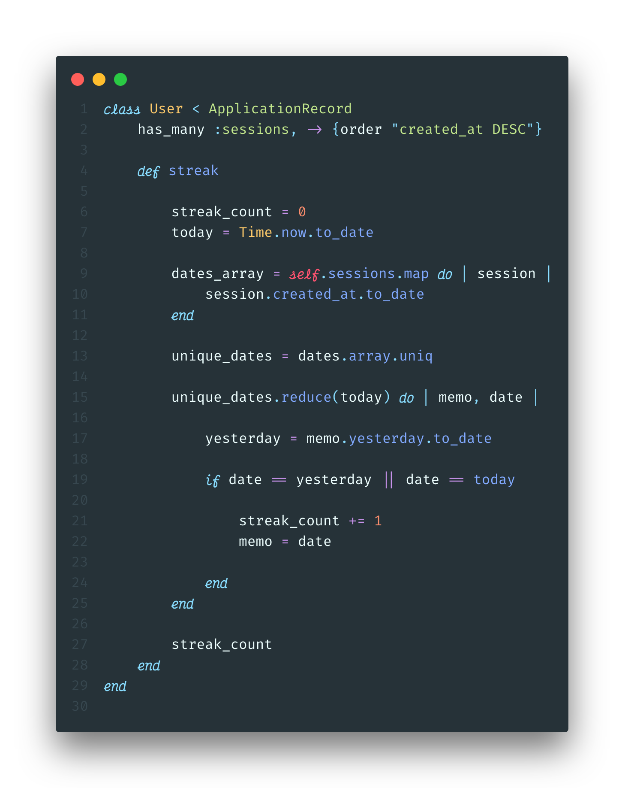
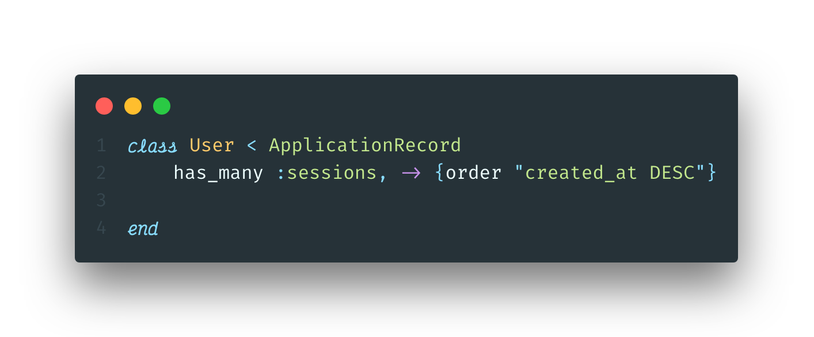
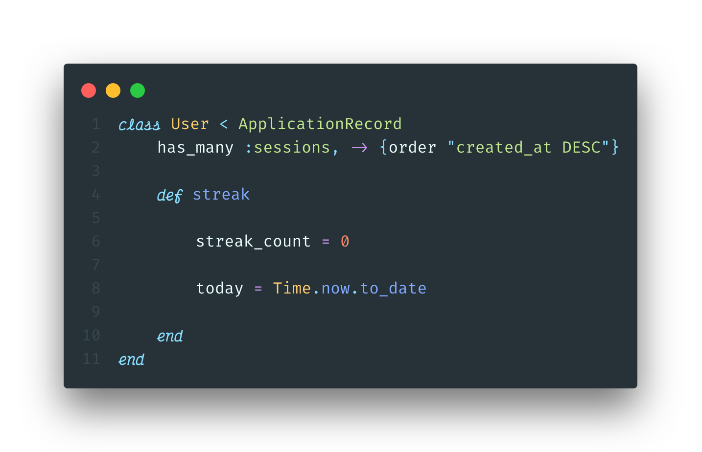
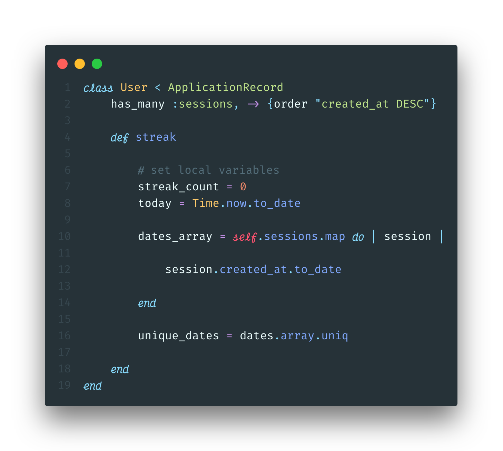
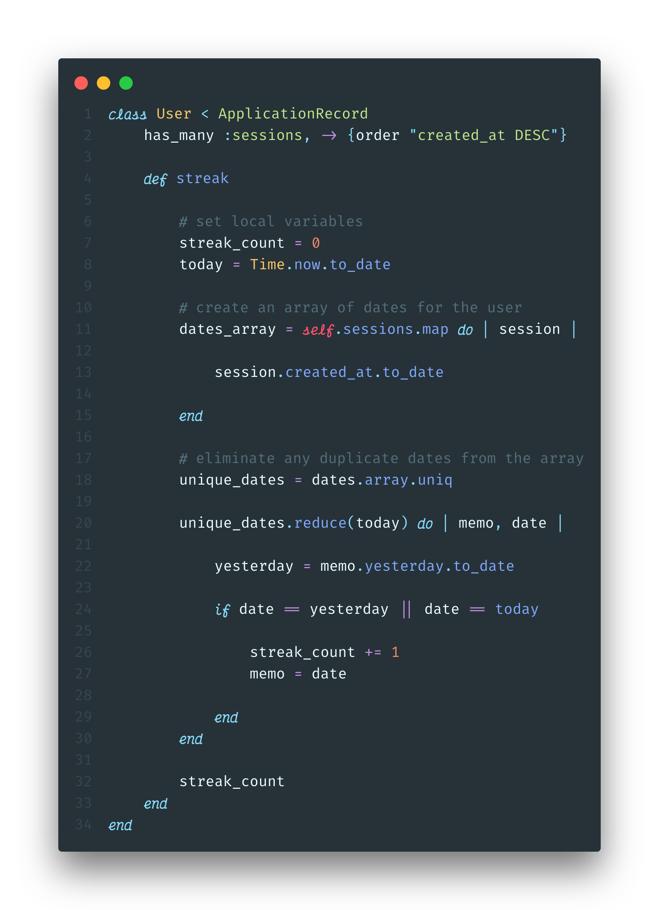
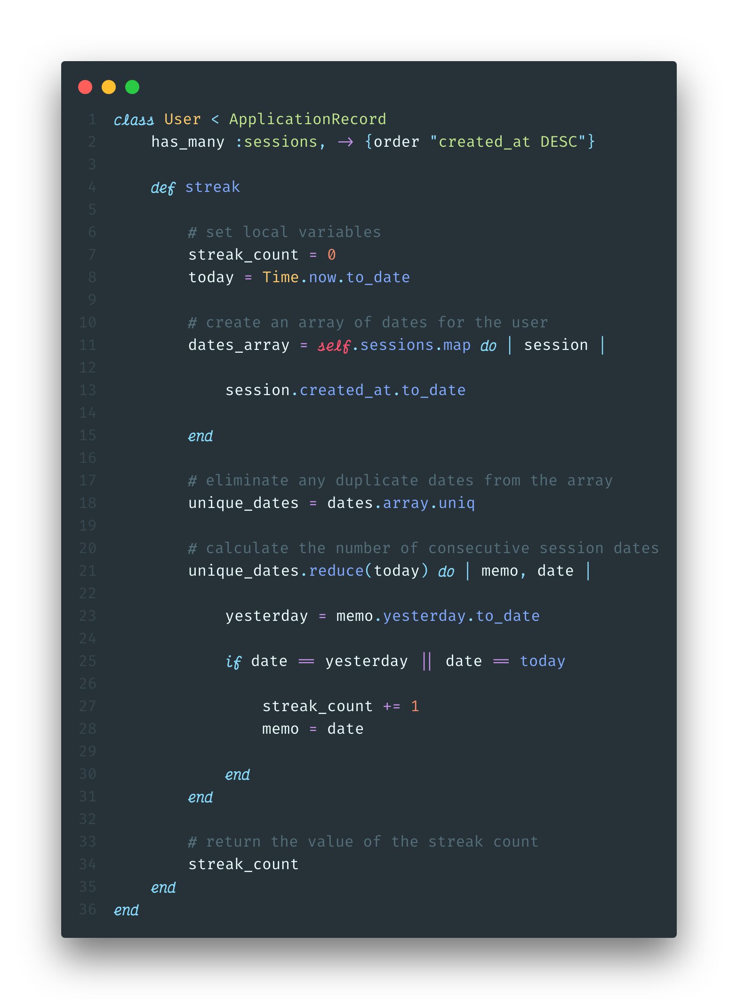

---

From Duolingo to Headspace, many of the most popular apps today track users' "streaks". By keeping track of the number of days in a row a user has logged in and completed a task, these apps aim to create a beneficial habit for the user, while simultaneously insuring an active daily user base. Evidence seems to indicate that desire to keep a streak going will indeed motivate a person to do a task they might not otherwise.

With streaks being such a popular feature, a [friend](https://medium.com/@avijitklodh) and I decided to try and incorporate it into a recent project we were working on. The application walked a user through the steps of a [Wim Hof](https://www.wimhofmethod.com/) breathing cycle, and we wanted to display the number of days in a row they had completed at least one cycle.

## Table of Contents

- [Table of Contents](#table-of-contents)
  - [The goal](#the-goal)
  - [The solution](#the-solution)
  - [The breakdown](#the-breakdown)
    - [Step 1: Set up relationships](#step-1-set-up-relationships)
    - [Step 2: Define an instance method](#step-2-define-an-instance-method)
    - [Step 3: Create an array of dates](#step-3-create-an-array-of-dates)
    - [Step 3: Calculate the streak](#step-3-calculate-the-streak)
    - [Congrats! You can now calculate user streaks in your rails application](#congrats-you-can-now-calculate-user-streaks-in-your-rails-application)
  - [GitHub Gist](#github-gist)
  - [References](#references)

### The goal

Track the number of consecutive days a logged-in user completed a breathing cycle, and display that number on the home page of our application. When the user completes a new session on a consecutive day for the first time, that number should update immediately.

### The solution

After a few unsuccessful attempts at using gems or code-snippets, we decided it would be easier and a better learning experience to write our own code. We also opted to track the streaks in the back end, because Ruby makes working with dates and times simpler. Here is the final version:



### The breakdown

Our application is built on a ruby-on-rails back-end, with a vanilla JavaScript front end. There are two models: `User` and `Session`. A `Session` *belongs to* a `User`, and a `User` *has many* `Sessions`.

#### Step 1: Set up relationships



First we need to create a Ruby class of User, which inherits from `ApplicationRecord`, a rails model which includes the [Active Record](https://guides.rubyonrails.org/active_record_basics.html) ORM (more on Object-Relational-Mappers [here](https://blog.bitsrc.io/what-is-an-orm-and-why-you-should-use-it-b2b6f75f5e2a)). We can then add the ActiveRecord syntax for a has-many relationship as seen on line 2. This allows us to access all of a User's sessions by simply calling `.sessions` on in instance of a `User`. Additionally, Active Record relationships can take a second argument, [scope](https://edgeguides.rubyonrails.org/association_basics.html#scopes-for-belongs-to), which allows us to customize the SQL query. We will want to haver our array ordered from most recent date to least recent date, which can be accomplished if we query for _**descending**_ order:

```ruby
has_many :sessions, -> {order "created_at DESC"}
```

#### Step 2: Define an instance method



Next, we need to create an instance method, `streak`, that we can call on an instance of a `User` to get their streak. Inside this method, we will declare a a couple local variables we will need later in the function. First, lets set `streak_count` to 0. We should also define `today` for readability. Ruby allows us to easily find and format the current day using `Time.now.to_date`. `Time.now` will return a date in a long format:

```ruby
Time.now
=> 2019-10-15 16:16:16 -0400
```

Since we only want to keep track of days, we can get rid of all of the extraneous information using `to_date`. This will return a simple, readable date format.

```ruby
Time.now.to_date
=> 2019-10-15
```

#### Step 3: Create an array of dates



In order to make sure that multiple sessions in the same day will not count towards the streak, we want to create an array only containing the unique dates. We will do this in two steps:

   1. Using the enumerable method `.map`, we can create an array of dates converted from the `created-at` timestamp for every session.

```ruby
dates_array = self.sessions.map do |session|
   session.created_at.to_date
end
 ```

   2. Apply `.uniq` to that array to ensure it only includes unique dates.

```ruby
 unique_dates = dates_array.uniq
 ```

Finally, we need to establish a default value for the `streak_count`, `0`. We now have most of the variables we will need to calculate the streak!

#### Step 3: Calculate the streak

For this step, we will take advantage of the Ruby enumerable method `reduce`. If you are not familiar with reduce, I would recommend checking out this [great article](https://mixandgo.com/learn/what-is-a-ruby-reducer).



Lets walk through this method. The basic structure of a reducer in pseudocode looks like this:

```ruby
array_variable.reduce(starting_value) do | accumulator, current_element |
   action
end
```

Typically, the accumulator (conventionally called the `memo`) is the return value of the method. For example, if you were calculating the sum of an array of numbers, it would look like this:

```ruby
[1, 2, 3].reduce(0) { |memo, n| memo + n }
# => 6
```

However, for our method, we need to track two different variables: the current streak value, and the date of the *last consecutive session*. This is because we are counting in reverse chronological order, starting with today's date. Lets break it down:

```ruby
unique_dates.reduce(today) do | memo, date |

   yesterday = memo.yesterday.to_date

end
```

Here we are calling reduce on the unique dates array, and passing in `today`, which we defined in step 2, as starting value for the memo. Then we are defining a local variable, `yesterday`, as the reformatted date of the day before the memo.

```ruby
unique_dates.reduce(today) do | memo, date |

      yesterday = memo.yesterday.to_date

      if date == yesterday || date == today

            streak_count += 1
            memo = date

      end
end
```

Finally, we want to create an *if* statement that determines when to increment the streak count. If the user had finished a session today, then `date` will be equal to today during first iteration through the array; we would want to increment then. For each following iteration, we want to check if `date` is equal to `yesterday`. If it is, that means that the user has finished a session three days in a row, and so we should increment again. This will continue to increment as long as the next date in the array is the day prior to the current date we are iterating over. This works because we ordered the `sessions` array in descending order based on their `created_at` attributes, as mentioned above.

**important:** Don't forget to return the streak count at the end of the `streak method`, or else the return value will be the final memo from our reducer.

#### Congrats! You can now calculate user streaks in your rails application

This code should be modifiable to work with any Active Record model with a *has_many* relationship. Good luck tracking all those streaks!

Below is the final code with comments included, and you can check out the app this code was written for [here](https://shanelonergan.github.io/breathe/).



### GitHub Gist

<script src="https://gist.github.com/shanelonergan/b86a6704ca1e7d7c9a4a610c8f363ee6.js"></script>

### References

- [Wim Hof Method](https://www.wimhofmethod.com/)
- [Active Record Basics](https://guides.rubyonrails.org/active_record_basics.html)
- [What is an ORM and Why You Should Use it](https://blog.bitsrc.io/what-is-an-orm-and-why-you-should-use-it-b2b6f75f5e2a)
- [What is a Ruby Reducer?](https://mixandgo.com/learn/what-is-a-ruby-reducer)
- [Scopes for belongs_to](https://edgeguides.rubyonrails.org/association_basics.html#scopes-for-Belongs-to)
