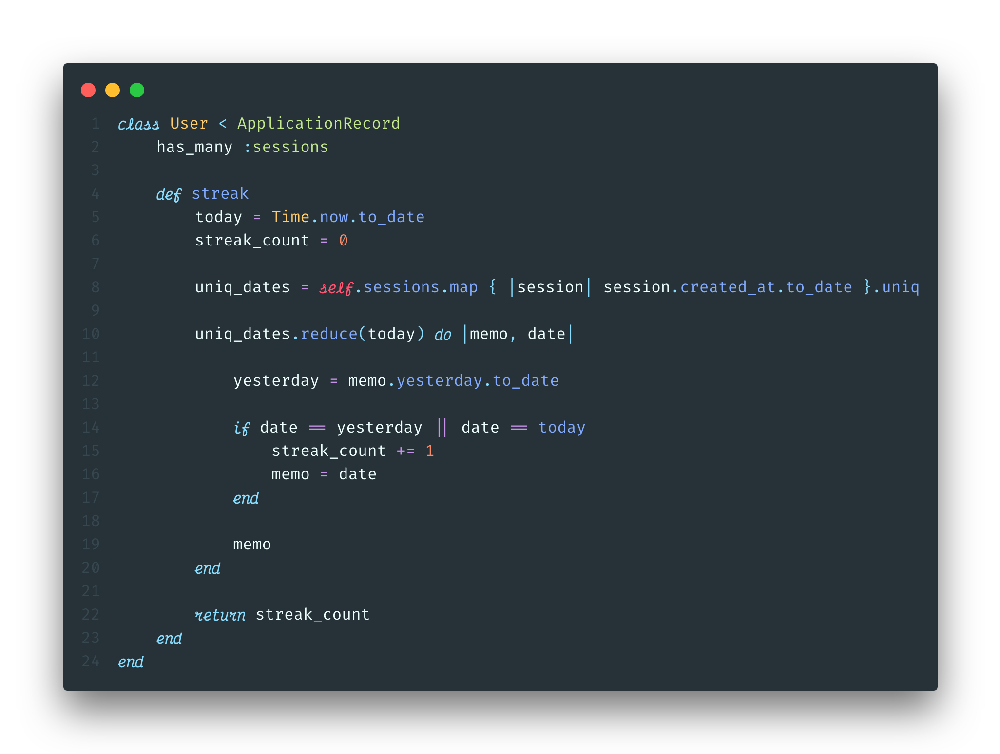
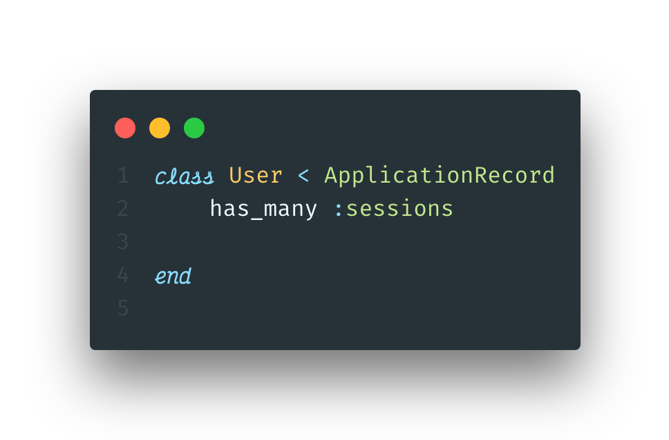
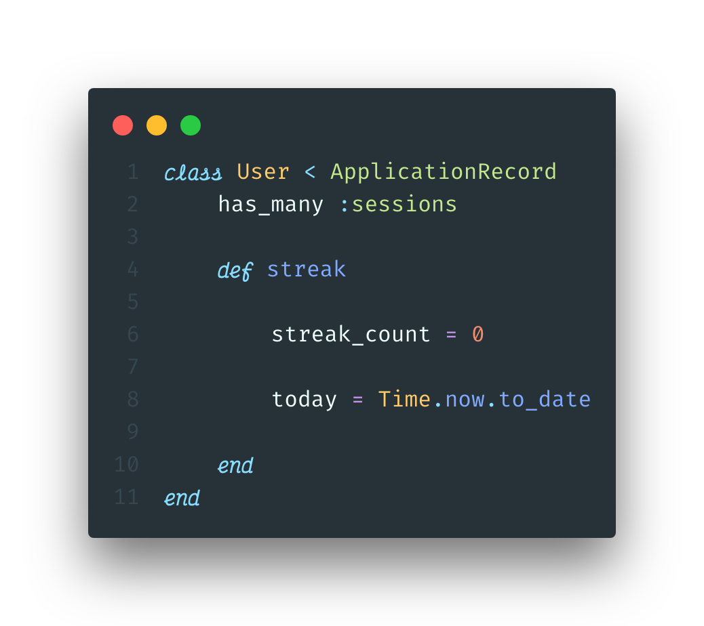
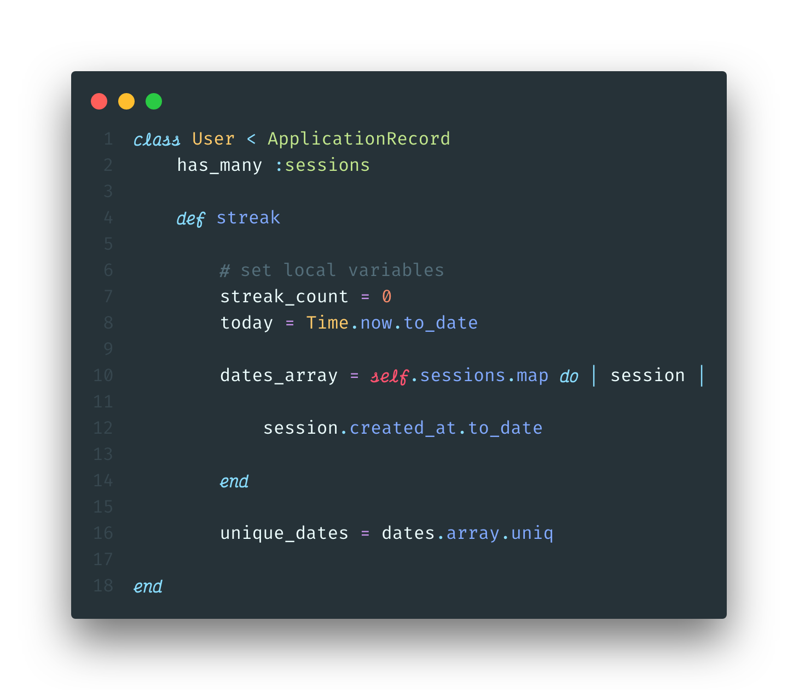
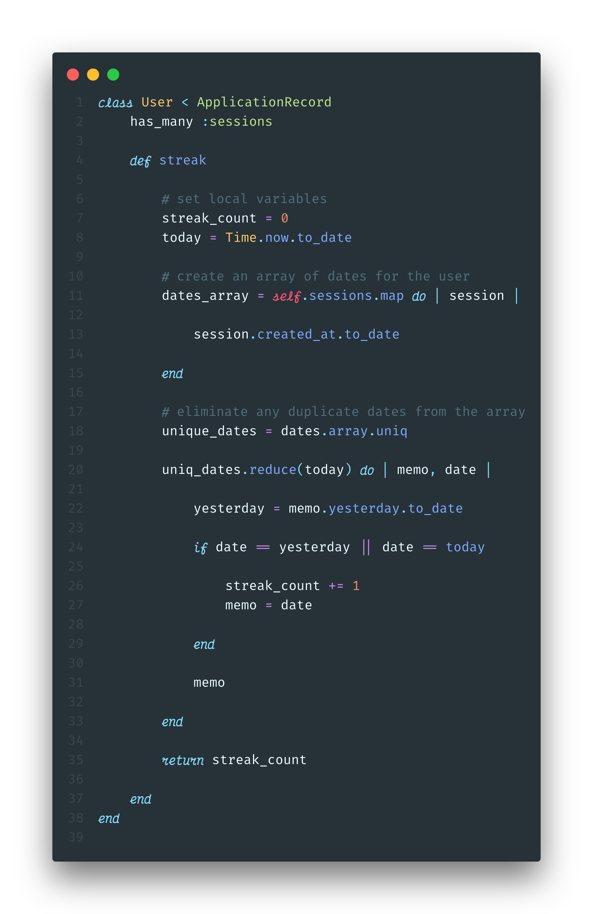
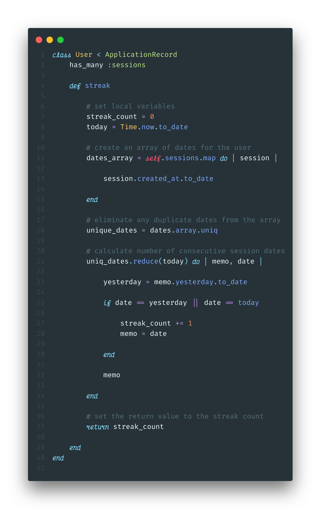

---

From Duolingo to Headspace, many of the most popular apps today track user's "streaks". By keeping track of the number of days in a row a user has logged in and completed a task, these apps aim to create a beneficial habit for the user, while simultaneously insuring an active daily user base. Evidence seems to indicate that desire to keep a streak going will indeed motivate a person to do a task they might not otherwise.

With streaks being such a popular feature, a friend and I decided to try and incorperate it into a recent project we were working on. The application walked a user through the steps of a wim-hof breathing cycle, and we wanted to display the number of days in a row they had completed at least one cycle.

### The goal

Track the number of consecutive days a logged-in user completed a breathing-cycle, and display that number on the home pahe of our application. When the user completes a new session on a consecutive day for the first time, that number should update immediatly.

### The solution

After a few uncessful attempts at using gems or code-snippets, we decided it would be easier and a better learning experience to write our own code. We also opted to track the streaks in the back end, because Ruby makes working with dates and times simpler. Here is the final version:



### The breakdown

Our application is built on a ruby-on-rails back-end, with a vanilla JavaScript front end. There are two models: `User` and `Session`. A `Session` *belongs to* a `User`, and a `User` *has many* `Sessions`.

#### Step 1: Set up relationships



First we need to create a Ruby class of User, which inherits from `ApplicationRecord`, which is a rails model which includes ActiveRecord. We can then add the ActiveRecord syntax for a has-many relationship as seen on line 2. This allows us to access all of a User's sessions by simply calling `.sessions` on in instance of a `User`.

#### Step 2: Create a class method



Next, we need to create an instance method, `streak`, that we can call on an instance of a `User` to get their streak. Inside this method, we will declare a a couple local variables we wil need later in the function. Ruby allows is to easily find and format the current day using `Time.now.to_date`. `Time.now` will retrun a date in a long format:
```ruby
Time.now
=> 2019-10-15 16:16:16 -0400
```
Since we only want to keep track of days, we can get rid of all of the extraneous information using `to_date`. This will return a simple, readable date format.
```ruby
Time.now.to_date
=> 2019-10-15
```

### Step 3: Create an array of dates



In order to make sure that multiple sessions in the same day will not count towards the streak, we want to create an array only containing the unique dates. We will do this in two steps:

   1. Using the enumberable method `.map`, we can create an array of dates converted from the `created-at` timestamp for every session.

```ruby
dates_array = self.sessions.map do |session|
   session.created_at.to_date
end
 ```

   2. Apply `.uniq` to that array to ensure it only includes unique dates.

```ruby
 unique_dates = dates_array.uniq
 ```

Finally, we need to establish a default value for the `streak_count`, `0`. We now have most of the variables we will need to calculate the streak!

#### Step 3: Calculate the streak

For this step, we will take advantage of the Ruby enumerable method `reduce`. If you are not familiar with reduce, I would recommend checking out this [great article](https://mixandgo.com/learn/what-is-a-ruby-reducer).



Lets walk through this method. The basic structure of a reducer in psuedocode looks like this:

```ruby
array-variable.reduce(starting_value) do | accumulator, current_element |
   action
end
```

Typically, the accumulator (conventionally called the `memo`) is the return value of the method. For example, if you were calculating the sum of an array of numbers, it would look like this:

```ruby
[1, 2, 3].reduce(0) { |memo, n| memo + n }
# => 6
```

However, for our method, we need to track two different variables: the current streak value, and the date of the *last consecutive session*. This is because we are counting in reverse chronological order, starting with today's date. I find it helpful to conceptualize this through a metaphor:

>Imagine you have been shrunk down in honey-I-shrunk-the-kinds style.  The date you are standing on is *today*, and the day in front of you is *yesterday*. If you were to walk forward, you would be walking back in time. Make sense? Now, you will first check if there was a session completed *today*. If there was, increment the streak count by 1. Then, look forward and see if there was a session completed yesterday. If there was, increment the streak count by 1 and move forward into *yesterday*. Once you step forward, *yesteray* becomes *today*. Congrats! You are now a time traveller. Standing on the new *today*, look forward to the new *yesterday*. If there was a session completed on that day, increment, and step forward again. Repeat this time-travelling process until you encounter a *yesterday* without a serssion completed. Once you do, you have your current streak count!

In this metaphor, we can keep track of the date of the last consecutive session because we are standing on it. In our function, we will keep track of it by saving it to our memo. Since we also want to kep track of the streak_count, as well as have it be the return value of the entire `streak` method, we initialized it as a variable outside of our reducer. We can then increment this inside the reducer. Here is the code:

```ruby
uniq_dates.reduce(today) do | memo, date |

   # set the value of yesterday as the date before "today"
   yesterday = memo.yesterday.to_date

      # check if the this interation's date is equal to either today or yesterday
      if date == yesterday || date == today

         # increment the streak count
         streak_count += 1

         # set the memo to thi round's date
         memo = date

      end

   # return the memo so we have access to it in the next interation
   memo

end
```


#### Congrats! You can now calculate user streaks in your rails application.

**important:** Don't forget to return the streak count at the end of the `streak method`, or else the return value will be the final memo from our reducer.


