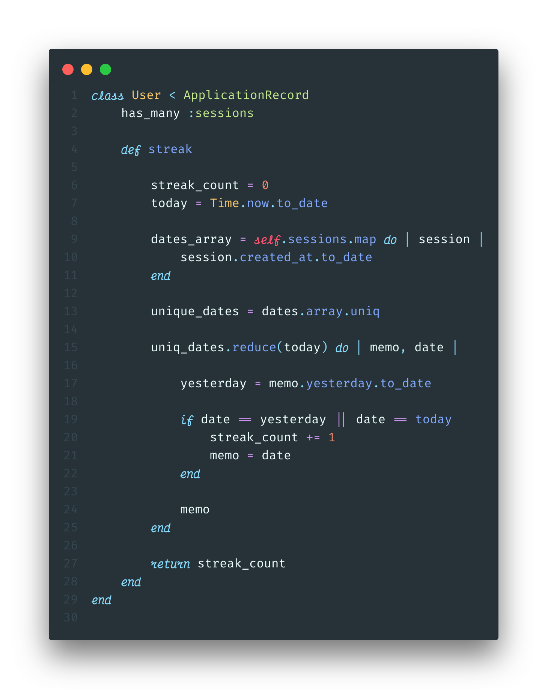

---
### outline

1. Intro
   1. anecdote/why tracking user streaks is common/useful
      1. maybe data about how streaks help bring users back.
   2. explain project with Avi/struggles we went through
   3. maybe why soving this problem in ruby is a good idea?
2. The code
   1. show the code first in one big block
3. The breakdown
   1. datetime in ruby
   2. walk through a pseaudocode (reverse 1 and 2?)
   3. add code step by step
4. Wrap up/summary/conclusion

From Duolingo to Headspace, many of the most popular apps today track user's "streaks". By keeping track of the number of days in a row a user has logged in and completed a task, these apps aim to create a beneficial habit for the user, while simultaneously insuring an active daily user base. Evidence seems to indicate that desire to keep a streak going will indeed motivate a person to do a task they might not otherwise.

With streaks being such a popular feature, a friend and I decided to try and incorperate it into a recent project we were working on. The application walked a user through the steps of a wim-hof breathing cycle, and we wanted to display the number of days in a row they had completed at least one cycle.

### The goal

Track the number of consecutive days a logged-in user completed a breathing-cycle, and display that number on the home pahe of our application. When the user completes a new session on a consecutive day for the first time, that number should update immediatly.

### The solution

After a few uncessful attempts at using gems or code-snippets, we decided it would be easier and a better learning experience to write our own code. We also opted to track the streaks in the back end, because Ruby makes working with dates and times simpler. Here is the final version:



### The breakdown

Our application is built on a ruby-on-rails back-end, with a vanilla JavaScript front end. There are two models: `User` and `Session`. A `Session` *belongs to* a `User`, and a `User` *has many* `Sessions`.

#### Step 1: Set up relationships


First we need to create a Ruby class of User, which inherits from `ApplicationRecord`, which is a rails model which includes ActiveRecord. We can then add the ActiveRecord syntax for a has-many relationship as seen on line 2. This allows us to access all of a User's sessions by simply calling `.sessions` on in instance of a `User`.

#### Step 2: Create a class method


Next, we need to create an instance method, `streak`, that we can call on an instance of a `User` to get their streak. Inside this method, we will declare a a couple local variables we wil need later in the function. Ruby allows is to easily find and format the current day using `Time.now.to_date`. `Time.now` will retrun a date in a long format:
```ruby
Time.now
=> 2019-10-15 16:16:16 -0400
```
Since we only want to keep track of days, we can get rid of all of the extraneous information using `to_date`. This will return a simple, readable date format.
```ruby
Time.now.to_date
=> 2019-10-15
```

### Step 3: Create an array of dates


In order to make sure that multiple sessions in the same day will not count towards the streak, we want to create an array only containing the unique dates. We will do this in two steps:

   1. Using the enumberable method `.map`, we can create an array of dates converted from the `created-at` timestamp for every session.

```ruby
dates_array = self.sessions.map do |session|
   session.created_at.to_date
end
 ```

   2. Apply `.uniq` to that array to ensure it only includes unique dates.

```ruby
 unique_dates = dates_array.uniq
 ```

Finally, we need to establish a default value for the `streak_count`, `0`. We now have most of the variables we will need to calculate the streak!

#### Step 3: Calculate the streak

For this step, we will take advantage of the Ruby enumerable method `reduce`. If you are not familiar with reduce, I would recommend checking out [this](wwww.put-link-here.com) great article.


Lets walk through this method. The basic structure of a reducer in psuedocode looks like this:

```ruby
array-variable.reduce(starting_value) do | accumulator, current_element |
   action
end
```

Typically, the accumulator (conventionally called the `memo`) is the return value of the method. For example, if you were calculating the sum of an array of numbers, it would look like this:

```ruby
[1, 2, 3].reduce(0) { |memo, n| memo + n }
# => 6
```

However, for our method, we need to track two different variables: the current streak value, and the date of the *last consecutive session*. This is because we are counting in reverse chronological order, starting with today's date. I find it helpful to conceptualize this through a metaphor:

>Imagine you are walking on a giant calendar. The date you are standing on is *today*, and the day in front of you is *yesterday*. If you were to walk forward, you would be walking back in time. Make sense? Now, you will first check if there was a session completed *today*. If there wasn't, the streak count should remain at 0. If there was, increment the streak count by 1. Then, look forward and see if there was a session completed yesterday. If there was, inrement the streak count and move forward into *yesterday*. Once you step forward, *yesteray* becomes *today*.

In this metaphor, we can keep track of the date of the last consecutive session because we are standing on it. In our function, we will save it to our memo, because it is the value we want to

#### Congrats! You can now calculate user streaks in your rails application.


