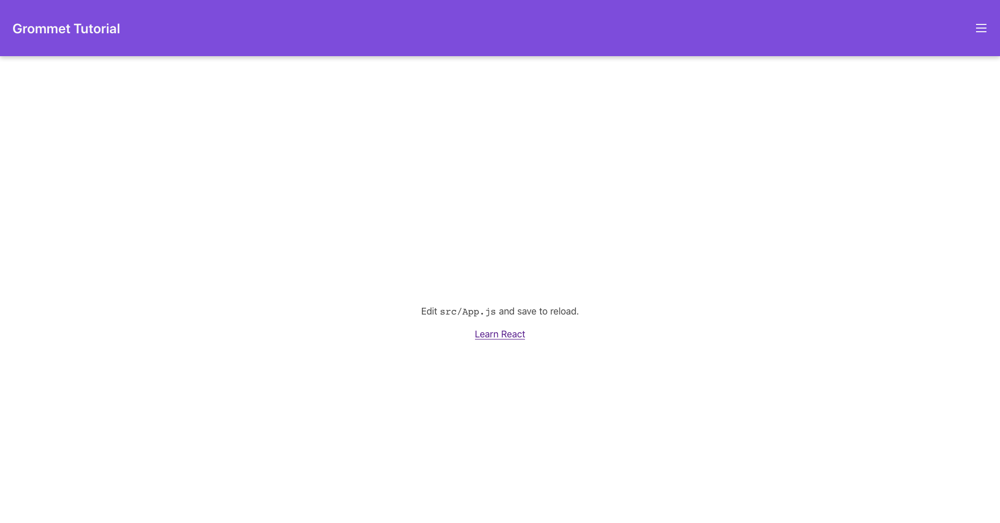

---

Welcome to Part 2 of my Introduction to Grommet UI! If you haven't read part one, feel free to check that out [here](https://shanelonergan.github.io/grommet/). In this post we will look at integrating React state to make our user interface more dynamic, as well as optimizing our site for mobile. Lets dive right in!

## Table of Contents

- [Table of Contents](#table-of-contents)
- [Starting off](#starting-off)
- [Build the Sidebar](#build-the-sidebar)
- [Adding State](#adding-state)

## Starting off

When we left off in Part 1, our app looked like this:



And our `App.js` looked like this:

```js
import React from 'react'
import { Grommet, Box, Heading, Button } from 'grommet'
import { grommet as light, dark } from 'grommet/themes'
import { Menu } from 'grommet-icons'

const NavBar = (props) => (
    <Box
        tag='header'
        direction='row'
        align='center'
        justify='between'
        background='brand'
        pad={{ left: 'medium', right: 'small', vertical: 'small' }}
        elevation='medium'
        {...props}
    />
)

function App() {
    return (
        <Grommet theme={light} full>
            <NavBar>
                <Heading level='3'>Grommet Tutorial</Heading>
                <Button icon={<Menu />} onClick={() => {}} />
            </NavBar>
            <Box flex align='center' justify='center'>
                app body
            </Box>
        </Grommet>
    )
}

export default App
```

It looks pretty good so far, but is completely static. Lets add some interactivity to the menu by adding a sidebar that slides out when you click the menu icon.

## Build the Sidebar

First, lets build a static version of the sidebar. To do this, we will first want to divide the body into to parts, the app body and the sidebar. We only want to divide the area beneath the NavBar though, so lets create a new box where we can put both the app body and sidebar:

```js
///...

function App() {
    return (
        <Grommet theme={light} full>
            <NavBar>
                <Heading level='3'>Grommet Tutorial</Heading>
                <Button icon={<Menu />} onClick={() => {}} />
            </NavBar>
            <Box direction='row' flex> {/* new box */}
                <Box flex align='center' justify='center'>
                    app body
                </Box>

                {/* sidebar will go here */}
            </Box>
        </Grommet>
    )
}
```

We give this box the direction prop `row`, which means its children will align left to right, rather than vertically (the default). We also give it the `flex` prop, so that it will expand to take up the remaining available space. Now can build the sidebar as a separate component, and then add it to the box.

```js
const SideBar = () => (
	<Box width='medium' background='light-2' elevation='small' align='center' justify='center'>
		sidebar
	</Box>
)

function App() {
    return (
        <Grommet theme={light} full>
            <NavBar>
                <Heading level='3'>Grommet Tutorial</Heading>
                <Button icon={<Menu />} onClick={() => {}} />
            </NavBar>
            <Box direction='row' flex> {/* new box */}
                <Box flex align='center' justify='center'>
                    app body
                </Box>
                    <SideBar />
                </Box>
        </Grommet>
    )
}
```

Now you may notice that our content is properly aligned, but it isn't filling up the whole page! That is because it its parent container doesn't actually fill the whole page. To fix this, we can add one more box around everything, including the NavBar, and give that box the `fill` property. This will allow the app to fill the entire page, and get things looking nice.

```js
// ...
function App() {
    return (
        <Grommet theme={light} full>
            <Box fill> {/* new box */}
                <NavBar>
                    <Heading level='3'>Grommet Tutorial</Heading>
                    <Button icon={<Menu />} onClick={() => {}} />
                </NavBar>
                <Box direction='row' flex>
                    <Box flex align='center' justify='center'>
                        app body
                    </Box>
                    <SideBar />
                </Box>
            </Box>
        </Grommet>
    )
}
```

And just like that, we should have a sidebar! Now, we want to make it dynamic, so that when we click the menu icon it will disappear. To do this, we will have to incorporate some state.

## Adding State

To accomplish this, we are going to need to incorporate some React state. This will keep track of whether or not the sidebar should be displayed. To begin, lets import the useState hook along with React and create a state pair, like so:

```js
import React, { useState } from "react";

// ...

const App = () => {
    const [showSidebar, setShowSidebar] = useState(false);

    //...
}
```

Now, lets tie this state to the button so that we can toggle it. To do this, we just set the onClick callback function to `setShowSidebar`, and pass in the argument of `!showSidebar`, or the opposite of whatever showSidebar currently is.

```js
    <Button
        icon={<Menu />}
        onClick={() => setShowSidebar(!showSidebar)}
    />
```

Now we just need to conditionally render our sidebar based on the value of `setShowSidebar`. Luckily, Grommet has a component that will handle that for us, `Collapsible`, which also provides a smooth collapsing animation. To add this, we just need to wrap the SideBar in the `Collapsible`, and pass it a couple of props. We will also want to give the box inside our SideBar component the `flex` property, so it expands to fill the `Collapsable`.

```js
const SideBar = () => (
    <Box width='medium' background='light-2' elevation='small' align='center' justify='center' flex>
        sidebar
    </Box>
)

function App() {
    const [showSidebar, setShowSidebar] = useState(false);

    return (
        <Grommet theme={light} full>
            <Box fill>
                <NavBar>
                    <Heading level='3'>Grommet Tutorial</Heading>
                    <Button
                       icon={<Menu />}
                       onClick={() => setShowSidebar(!showSidebar)}
                   />
                </NavBar>
                <Box direction='row' flex>
                    <Box flex align='center' justify='center'>
                        app body
                    </Box>
                    <Collapsible direction="horizontal" open={showSidebar}>
                        <SideBar />
                    </Collapsible>
                </Box>
            </Box>
        </Grommet>
    )
}
```
