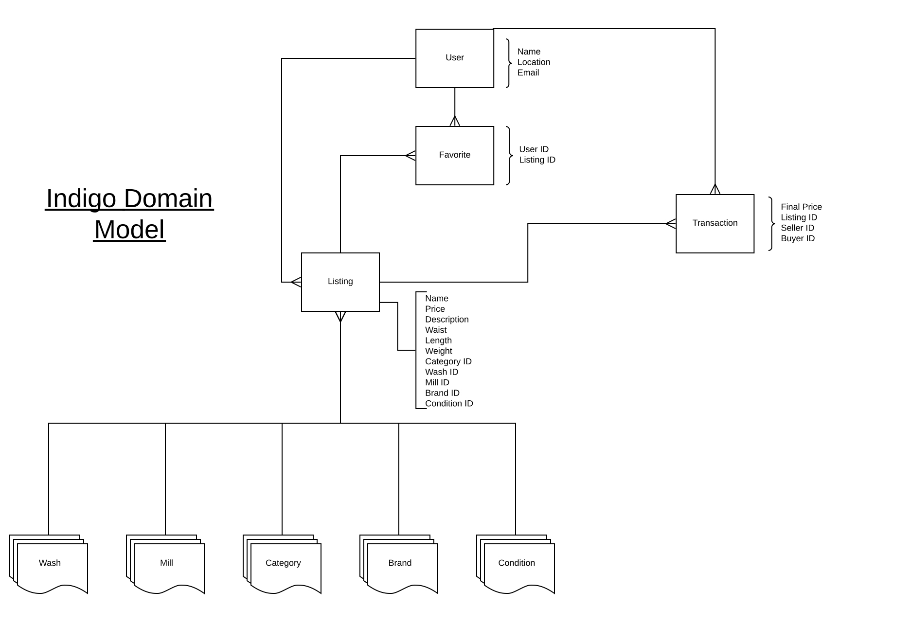

---

## Table of Contents

- [Table of Contents](#table-of-contents)
- [Phase 1: Dream big](#phase-1-dream-big)
- [Phase 2: Decide on MVP](#phase-2-decide-on-mvp)
- [Phase 3: Begin goals and wishes](#phase-3-begin-goals-and-wishes)
- [Phase 4: Create model trees and wireframes for MVP](#phase-4-create-model-trees-and-wireframes-for-mvp)
- [Phase 5: Brainstorm external technologies](#phase-5-brainstorm-external-technologies)
- [Phase 6: Code MVP](#phase-6-code-mvp)
- [Phase 7+: Add features](#phase-7-add-features)

Welcome to my guide in planning web development projects! In this article I will walk you through the way that I plan and build my personal projects. These are the techniques I have tested and found work well for me; workflow and productivity techniques are of course very personal, but I hope that through reading about my process, you will be able to learn something and apply it to your own.

Throughout this guide I will be using an project I built, indigo, as an example. You can check out this project on [GitHub](https://github.com/shanelonergan/indigo), or you can see the live demo [here](indigo-resale.store)

## Phase 1: Dream big

In this phase, I let my imagination run wild with all the possibilities. Nothing is impossible, and this is when ideas are narrowed down into a final idea. This is the least structured phase, and I let myself have a lot of fun coming up with ideas. Once I have decided on the final idea for the project, I move on to the next phase.

**Example:** Confession: I love clothes. I used to work in fashion retail, and I spend a lot of time on a clothing resale app called Grailed. It is a great marketplace to find used high-end and vintage clothing, snd they do a lot of great curation. I also love denim, and while I am not quite a denim-head, those that are have an obsessive level of knowledge about the garments they wear. The specific mill the denim came from (some mills, such as Cone or Kuroki, are quite legendary), the weight of the fabric, the fits and washes, etc. I thought it would be really fun to build a resale app of my own, but one that tailors specifically to denim lovers. You could sort and filter by the weight of the denim, or the by the mill origin. An app that made it easy to find the perfect pair of vintage Levi's made from Cone Mills selvedge denim. Users could list their own items for sale, buy others, and rate their transactions. The home page could feature a rotating selection of curated collections from different brands, mills, or washes. Maybe their could even be a media section that hosts articles about denim history, shopping advice, and more!

## Phase 2: Decide on MVP

Next I trim back the idea into a minimum viable product. What is the smallest possible form the project could take, and what are the essential core functions? I want to be as aggressive and realistic as possible during this phase so that I end up with a clean, simple MVP.  At this point I will also begin a Trello board, or something similar, to begin tracking the project.

## Phase 3: Begin goals and wishes

The goal list contains ideas and features that didn’t make it into the MVP, but I feel would greatly enhance the final product. The wish list contains any other ideas that might be nice to include down the line.

## Phase 4: Create model trees and wireframes for MVP

I will map out my domain models for my database relationships, and make sure they are airtight before writing any code. I will also create some wireframes for the landing page and any other essential pages for the application.

## Phase 5: Brainstorm external technologies

If I haven’t already, I will brainstorm any external APIs or libraries I want to try and integrate into this project. If I haven’t used them before, I will try and familiarize myself a little bit before jumping in. Usually this will take the form or reading some of the documentation, watching a few YouTube tutorials, and doing a quick test integration if necessary.

## Phase 6: Code MVP

I usually start with the back end, so I will build out my models and make sure the relationships are working properly, testing with a REST client, such as Insomnia or Postman, as I go. I commit to GitHub often, making sure to keep them small with specific commit messages. Once the back-end is set up, I move on to the front end. I like to work feature-by-feature, making sure to mark them as completed on Trello when finished. Once my MVP is complete, I will deploy, usually on Netlify and Heroku.

## Phase 7+: Add features

From here on out, I add features from the goal/wish lists on a development branch and merge them to deployment when they are ready. This is also when I take the time to improve the user experience and visual design of the application. My background is in the arts, so I really enjoy taking the time to create a visually appealing and intuitive user interface.
